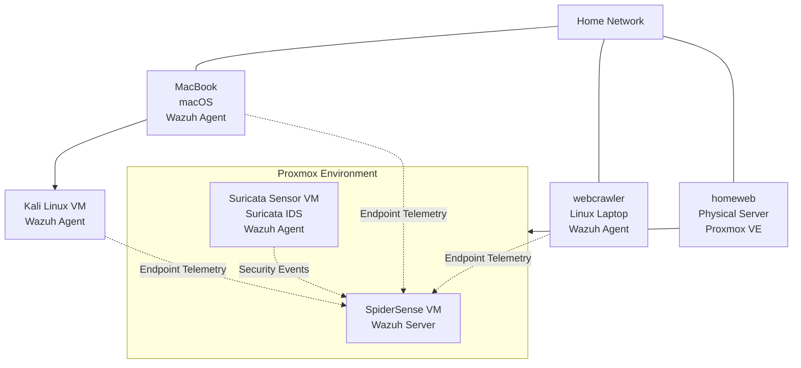
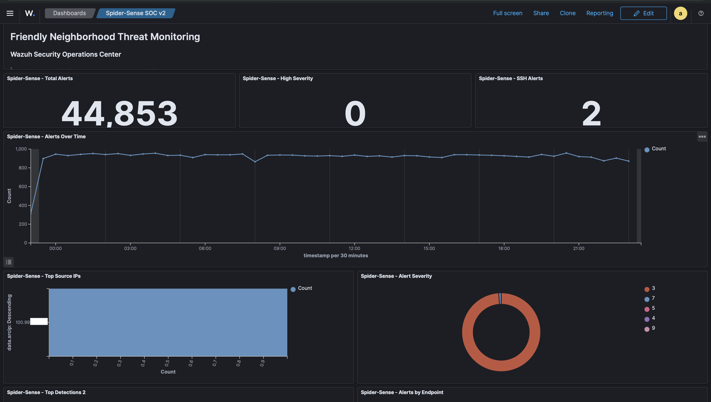
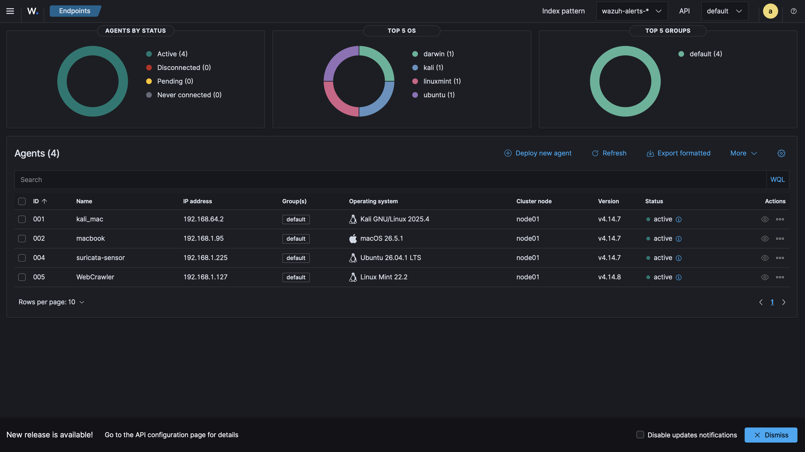
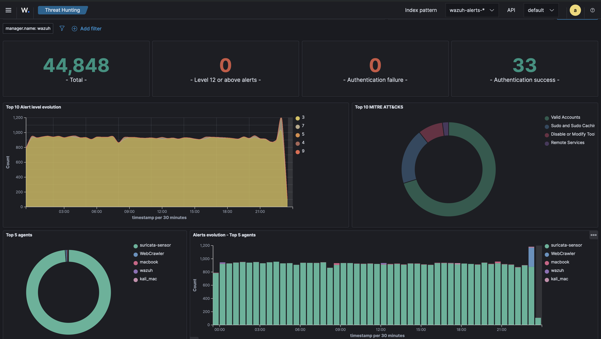
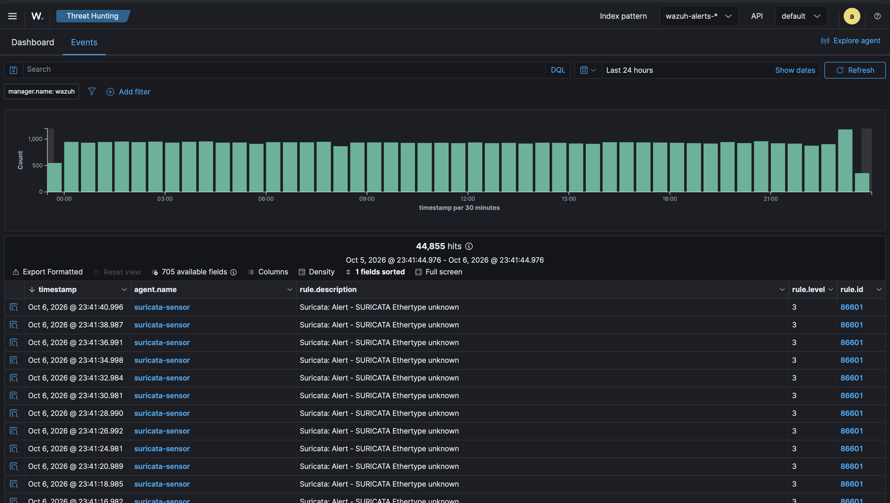

# Spider-Sense SOC

Spider-Sense is a personal Security Operations Center (SOC) homelab project designed to give me hands-on experience with security monitoring, threat detection, network visibility, and incident investigation.

The project uses Wazuh and Suricata to collect and analyze security events across my homelab environment. I built the environment to move beyond classroom concepts and gain practical experience working with security alerts, logs, endpoints, and network traffic.

## Project Goals

- Build and manage a functional home SOC environment
- Centralize security monitoring across multiple endpoints
- Monitor network activity using Suricata
- Analyze security alerts and suspicious activity
- Improve my ability to read and investigate security logs
- Practice documenting security findings and investigations
- Develop security automation using Python

## Technologies

- Wazuh
- Suricata
- Linux
- Proxmox
- Python
- Git/GitHub

## Current Environment

Spider-Sense currently monitors multiple devices and systems within my homelab environment. Wazuh provides centralized endpoint monitoring while Suricata provides network-based detection and visibility.

The environment has generated tens of thousands of security events, giving me a dataset to practice alert analysis, investigation, and detection engineering.

## Architecture

Spider-Sense uses a centralized Wazuh server running in a dedicated Proxmox VM to collect and analyze security telemetry from physical and virtual endpoints across my homelab.

For a detailed breakdown of the environment and its current limitations, see [`architecture/architecture.md`](architecture/architecture.md).

## Spider-Sense in Action

### SOC Dashboard

The custom Spider-Sense dashboard provides a centralized view of security activity across the monitored environment, including alert volume, severity, authentication activity, source activity, and endpoint detections.

### Monitored Endpoints

Wazuh agents provide endpoint telemetry from physical and virtual systems across the homelab.

### Threat Hunting

Wazuh Threat Hunting provides visibility into security events across monitored endpoints and maps relevant activity to MITRE ATT&CK techniques.

### Suricata Integration

The dedicated Suricata sensor forwards network security events to the centralized Wazuh server, allowing network-based detections to be analyzed alongside endpoint telemetry.

## Repository Structure

- `architecture/` - Sanitized architecture diagrams
- `configs/` - Sanitized configuration examples
- `detections/` - Detection rules and examples
- `investigations/` - Documented security investigations
- `screenshots/` - Sanitized dashboard screenshots
- `scripts/` - Security automation scripts
- `docs/` - Additional project documentation

## Planned Improvements

- Document real security investigations from the lab
- Map detections to MITRE ATT&CK techniques
- Develop Python-based security automation
- Improve alert enrichment and correlation
- Expand security monitoring capabilities
- Document lessons learned and technical challenges

## Security Notice

All configurations, screenshots, logs, and network information published in this repository are sanitized to prevent disclosure of credentials, private keys, sensitive network information, or other private data.
