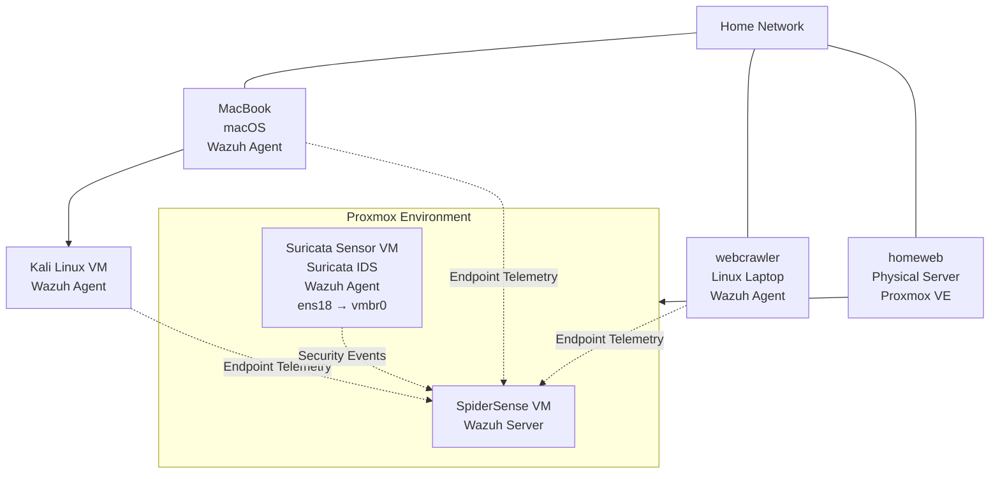

# Spider-Sense SOC Architecture Diagram

## Data Flow

Wazuh agents installed across the environment forward endpoint security telemetry to the centralized SpiderSense Wazuh server.

The dedicated Suricata sensor analyzes network traffic visible to its interface and forwards security telemetry to Wazuh through its Wazuh agent.

> **Current limitation:** The Suricata sensor is connected to the standard Proxmox `vmbr0` bridge and does not currently have guaranteed visibility into all home network traffic.
